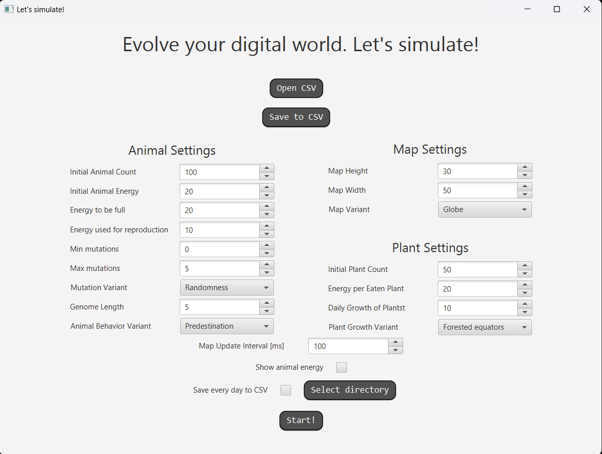
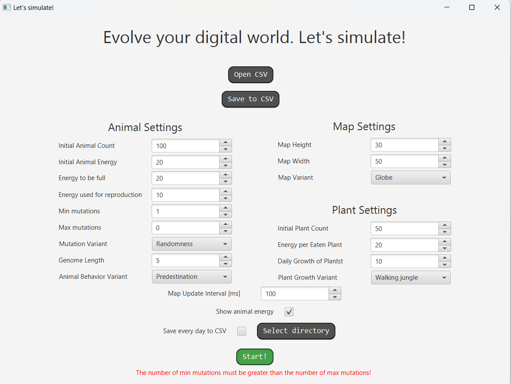
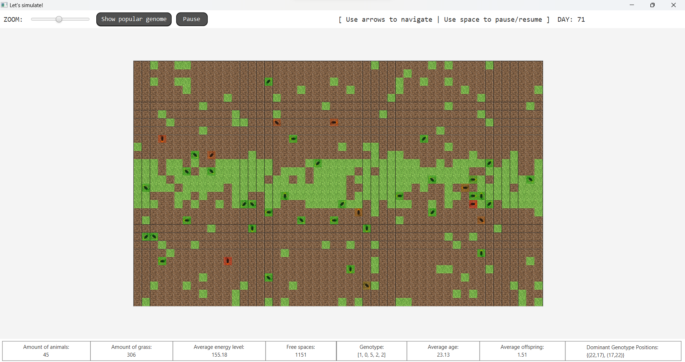
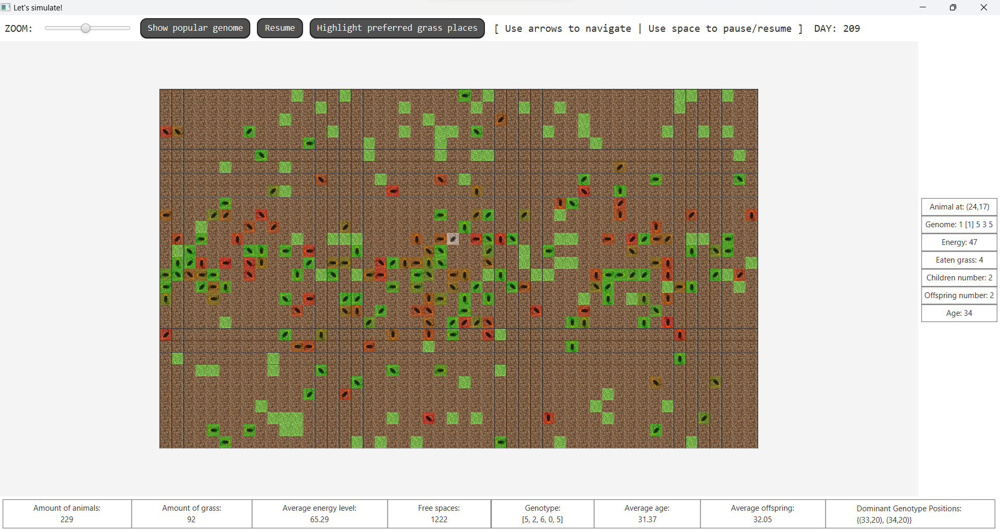
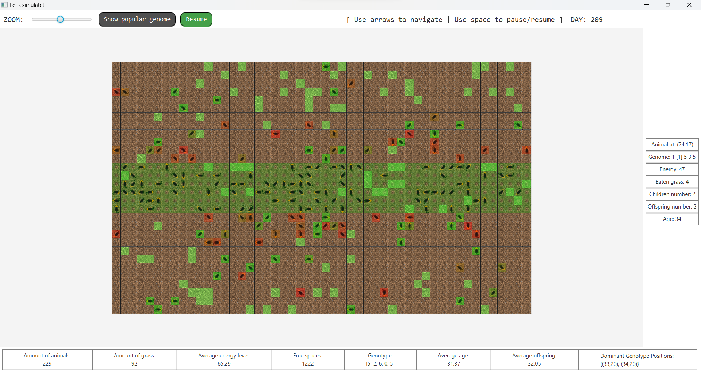
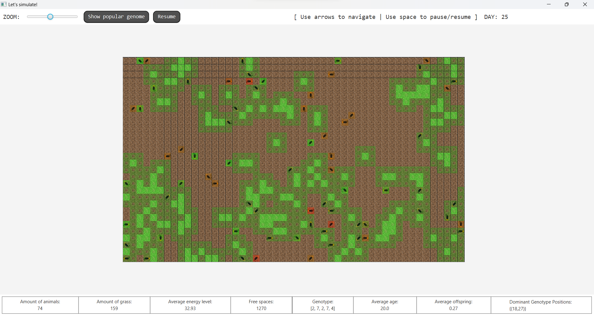

# Rozwiązanie projektu Darwin World

Wersja E4

Projekt był tworzony w grupach dwuosobowych 

## Panel początkowy:

## Komunikat błędu:

## Mapa zwierząt:

## Statystyki wybranego zwierzaka:

##Podświetlenie równika

**Podświetlenie dżungli**

